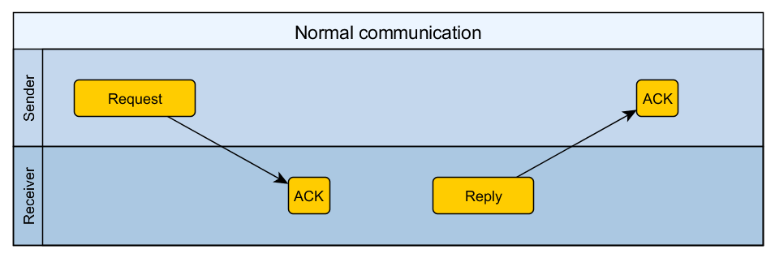
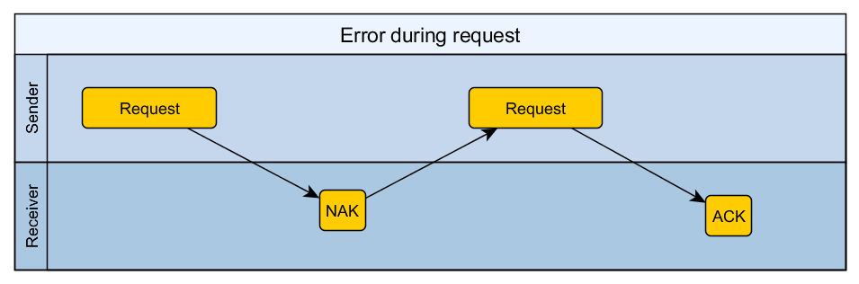
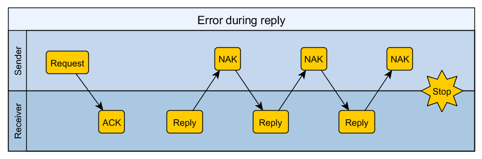

# Communication protocol

[TOC]

## Used constants

| Name  | Value (hex) |
| ----- | ----------- |
| `STX` | `0x02`      |
| `ETX` | `0x03`      |
| `ACK` | `0x06`      |
| `NAK` | `0x15`      |
| `ESC` | `0x1B`      |

## Frame format

|          | Size (bytes) | Description                              |
| :------- | :----------: | ---------------------------------------- |
| STX      |      1       | Frame start byte                         |
| Length   |      2       | Frame length without **STX** (Including **Length**'s 2 bytes). MSB first. (Equals to 6+N) |
| Frame ID |      1       | Frame id.                                |
| PAYLOAD  |      N       | See below (N ≥ 1)                        |
| CRC      |      1       | XOR of all bytes between (but not including) **STX** and **CRC** |
| ETX      |      1       | Frame end byte                           |

### PAYLOAD Request format

|         | Size (bytes) | Description        |
| ------- | ------------ | ------------------ |
| Command | 1            | Command byte       |
| Data    | M (M ≥ 0)    | Depends on command |

### PAYLOAD Reply format

|                 | Size (bytes) | Description        |
| --------------- | ------------ | ------------------ |
| Status          | 1            | Reply status byte  |
| Request command | 1            | Request command    |
| Data            | M (M ≥ 0)    | Depends on command |

## Algorithms

### Frame construction algorithm

1. Construct **PAYLOAD**
2. Calculate **PAYLOAD** length and append 5 (2+1+1+1)
3. Concatenate **Length**, **Frame ID** and **PAYLOAD**
4. Calculate and append CRC
5. Escape all occurrences of `STX`, `ETX` and `ESC` in data with `ESC`
6. Append **ETX** and prepend **STX**

### Frame deconstruction algorithm

1. Remove **STX** and **ETX**
2. Remove `ESC` from escaped characters (`STX`, `ETX` and `ESC`)
3. Check CRC

## Communication flow

